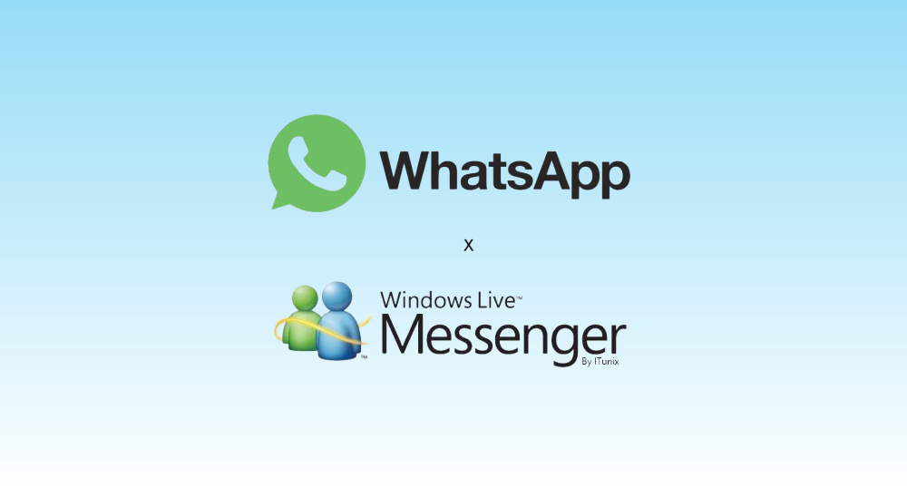
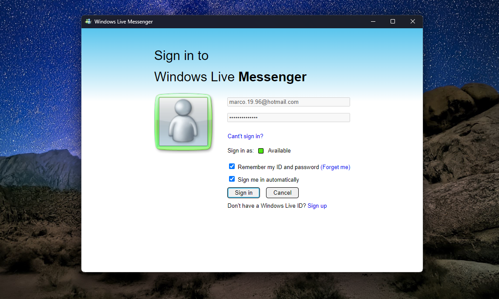
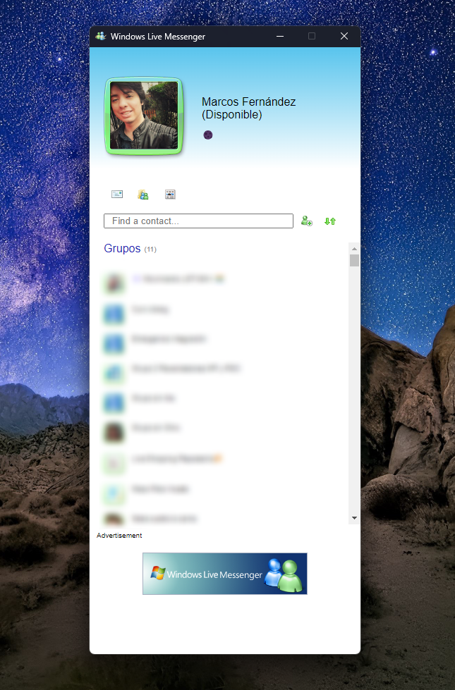
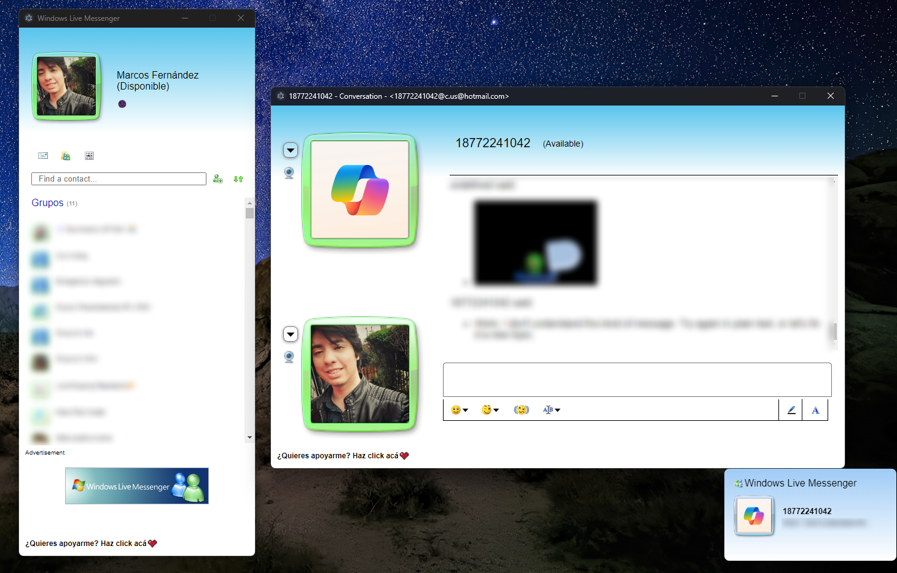

# Windows Live Messenger x Whatsapp

## Acerca de
**Cliente de WhatsApp que simula ser Windows Live Messenger.**

> ⚠️ **IMPORTANTE**  ⚠️
>
> **No se garantiza que no serás bloqueado al usar este método. WhatsApp no permite bots ni clientes no oficiales en su plataforma, por lo que este método no debe considerarse completamente seguro.**

## Apoya al proyecto

Puedes apoyarme a través de los siguientes enlaces:

## Descarga

## Pantallas

## Aviso Legal

Este proyecto no está afiliado, asociado, autorizado ni respaldado por WhatsApp o cualquiera de sus subsidiarias o afiliados de manera oficial. El sitio web oficial de WhatsApp se encuentra en .  
"WhatsApp", así como nombres relacionados, marcas, emblemas e imágenes, son marcas registradas de sus respectivos propietarios.  
Tampoco se garantiza que no serás bloqueado al usar este método. WhatsApp no permite bots ni clientes no oficiales en su plataforma, por lo que este método no debe considerarse completamente seguro.
